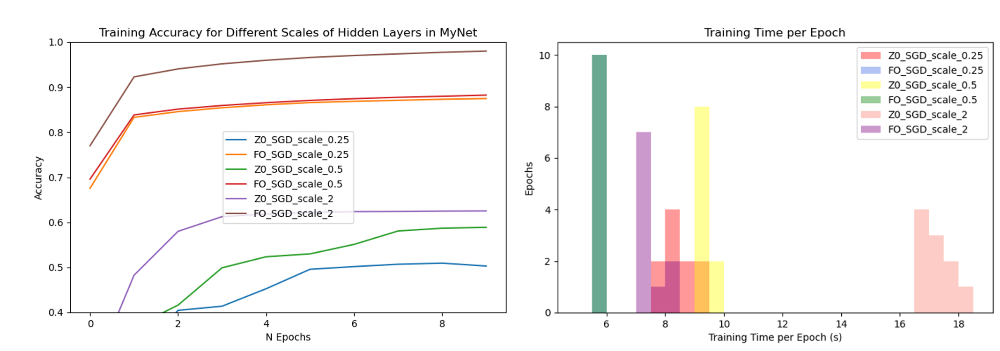
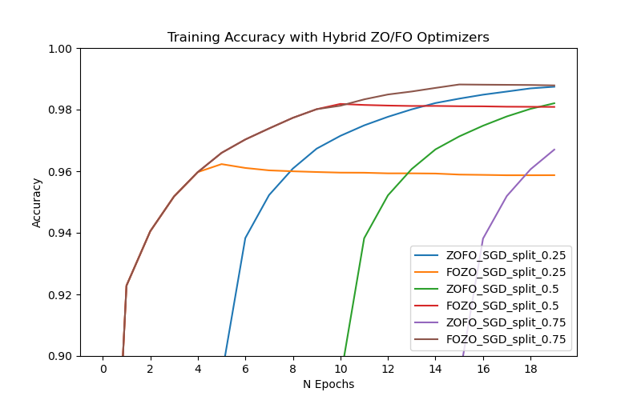

# OptML miniproject | Stochastic zeroth-order and first-order optimization
### How well do zero-order optimization methods do for ML applications, compared to standard first-order methods?

## Overview
This repository contains the source code of the miniproject for the course "CS-439 Optimization for Machine Learning" at EPFL. The performance of first-order methods, SGD and signSGD, and their ZO versions ZO-SGD and ZO-signSGD are compared with different hyperparameters and neural network configurations. The optimizers are evaluated on the MNIST dataset.

The repository is structured as below:
```
|------ conv_scale_hybrid             # Source code for model scaling and hybrid approach analysis
|------ figures                       # Figures for this readme
|------ metrics                       # Results of the experiments
|------ README.md                     # You are here
|------ data_analysis.ipynb           # Results visualization
|------ experiments.ipynb             # Run experiments
|------ fo_sgd.py                     # First-order SGD optimizer
|------ fo_sign_sgd.py                # First-order signSGD optimizer
|------ logistic_regression.ipynb     # Test code
|------ model.py                      # A fully connected NN and a CNN
|------ requirements.txt              # Required packages
|------ train.py                      # Functions for model training
|------ zo_sgd.py                     # Zeroth-order SGD optimizer with elementwise gradient estimation
|------ zo_sgd_vectorwise.py          # Zeroth-order SGD optimizer with vectorwise gradient estimation
|------ zo_sign_sgd.py                # Zeroth-order signSGD optimizer with elementwise gradient estimation
|------ zo_sign_sgd_vectorwise.py     # Zeroth-order signSGD optimizer with vectorwise gradient estimation
```

## Results
We performed a grid search on learning rate, momentum for FO-SGD, and forward difference estimate parameter $\epsilon$ for ZO-SGD and ZO-signSGD. We trained our MyNet model with the optimal parameter configuration for each optimizer. FO optimizers outperformed ZO optimizers in terms of training loss and accuracy. This is expected because ZO optimizers merely use estimates of the gradients. It is also notable that ZO optimizers seem to be giving more stable performance with the 4 optimal runs, which probably results from the landscape of the objective function. Since FO methods are using the actual gradient values, they tend to be more sensitive to the variance in the gradient.

<figure>
    
    <figcaption align="center"><b>Comparison of ZO and FO optimizers with optimal configurations</figcaption>
</figure>

Performance comparison was also conducted for different optimizers with same learning rates. The performance of FO optimizers appeared to be more sensitive to changes in the learning rate. Excessive learning rates could result in overshooting for FO optimizers. On the other hand, ZO optimizers utilize perturbation techniques to estimate the gradients which inherently introduce a level of noise. This noise can act as a regularizer, making ZO optimizers more robust to learning rate changes. Another point to note here is that to achieve similar performance, sign-optimizers generally require lower learning rates, which may be caused by the loss of information on gradient magnitude.

<figure>
    
    <figcaption align="center"><b>Comparison of ZO and FO optimizers using same learning rates</figcaption>
</figure>

In this part, we ran the training of our MyNet neural network with ZO and FO optimization (with optimal configurations) while scaling the hidden layer neuron complexity by scaling factors of $[0.25, 0.5, 2]$. We observed that scaling the model by a factor of 2 resulted in much higher accuracy. In terms of time efficiency, the ratio for epoch time at different scales differs across optimizers. Taking the ratio of epoch time at $s = 2$ to that at $s = 0.5$ yielded a much higher ratio ($r= 1.83$) for ZO optimizer than FO optimizer ($r = 1.27$). We can conclude that in our ML application, ZO-SGD is much more sensitive in terms of time efficiency to model scaling than FO-SGD, and ZO-SGD struggles more with high dimensionality than FO-SGD.

<figure>
    
    <figcaption align="center"><b>Training accuracy and time efficency with model scaling</figcaption>
</figure>

In cases where gradients are computationally more expensive than gradient approximation, hybrid optimization could be a powerful tool for overcoming this hurdle. In this part, a hybrid approach was evaluated where ZO-SGD and FO-SGD were sequentially applied with different epoch splits ($25\%:75\%, 50\%:50\%, 75\%:25\%$). We observed that all hybrid optimizers reached very high accuracies of at least 0.95, and that ZOFO optimizers out performed FOZO optimizers by small margins. This validated the use of hybrid optimizers as an efficient alternative even in the case of 25\% FO-SGD use.

<figure>
    
    <figcaption align="center"><b>Hybrid optimization for different epoch splits</figcaption>
</figure>

## Set-up
The packages needed for running our code include:
* torch
* torchvision
* numpy
* pandas
* matplotlib

Please follow the steps below to create a new python environment and install the packages.
```
python -m venv venv                   # create a python environment in the venv folder
source venv/bin/activate              # activate this environment
pip install jupyter                   # install jupyter notebook
pip install -r requirements.txt       # install requirements
```

## Reproduction
The results in this file can be reproduced as follows:
* Run ```experiments.ipynb```, the metrics and model weights will be automatically saved to ```./metrics``` and ```./model``` directories
* Run ```data_analysis.ipynb```, this visualizes the results in ```./metrics```
